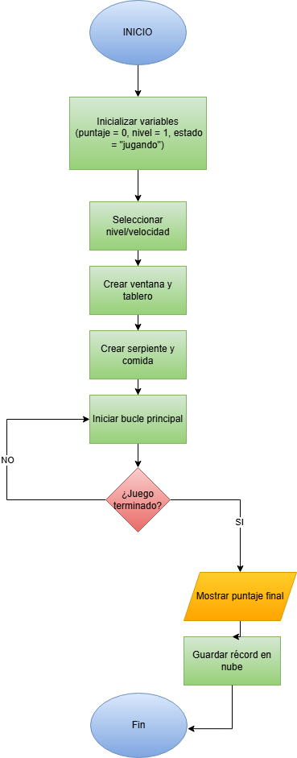
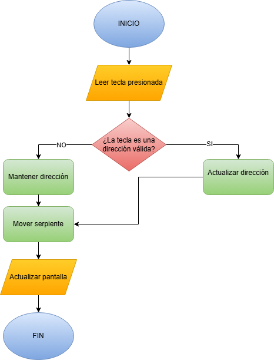
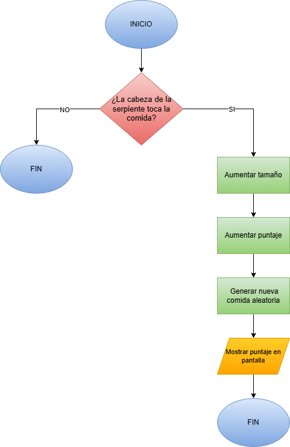
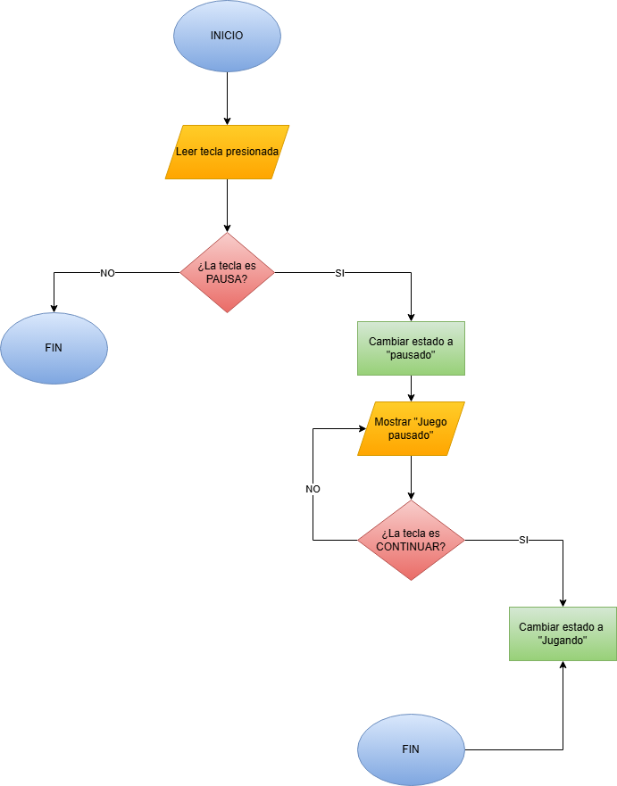

# 🐍 Juego de la Serpiente – Hecho por Josué Manosalvas

## 📖 Descripción
Este proyecto consiste en el desarrollo del juego clásico **La Serpiente (Snake)** utilizando Python.  
Forma parte del **Trabajo Autónomo y Proyecto Integrador Final** de la materia **Lógica de Programación**.

El proyecto incluye el código del juego, diagramas de flujo y documentación, integrando los conocimientos adquiridos durante las ocho semanas del curso, como lógica de programación, estructuras de control, funciones, modularidad y manejo de eventos.

---

## 📌 Información General
- **Asignatura:** Lógica de Programación  
- **Proyecto:** Integrador Final (8 semanas)  
- **Lenguaje:** Python  
- **Librería:** Pygame/Propia  
- **Fecha:** 23 de diciembre  
- **Autor:** Josué Manosalvas  

---

## 🧩 Desarrollo del Tema
El tema seleccionado es el desarrollo de un videojuego tipo **Snake**, el cual es un problema clásico pero adecuado para aplicar conceptos de programación.  
Este tema es factible y enfocado, ya que permite trabajar con lógica secuencial, manejo de eventos, estructuras de datos y control del flujo del programa.

Además, el proyecto no se limita únicamente al movimiento básico del juego, sino que incorpora niveles de dificultad, sistema de puntaje, pausa, pantallas adicionales y una estructura modular, lo que amplía el alcance del tema y demuestra una aplicación más completa de los contenidos de la asignatura.

---

## 🎯 Objetivo del Proyecto
El objetivo de este proyecto es desarrollar un videojuego interactivo tipo **Snake** que permita aplicar de forma práctica los conceptos vistos en clase, como el uso de estructuras de control, funciones, manejo de eventos, lógica del programa y una interfaz gráfica sencilla mediante Pygame.

---

## 🧠 Introducción
El juego de la serpiente consiste en controlar una serpiente que se mueve dentro de un área delimitada. El jugador debe comer la comida para aumentar su tamaño y obtener más puntos, evitando chocar con las paredes o con su propio cuerpo.

Este proyecto ayuda a reforzar la lógica de programación y a comprender cómo se integran los diferentes temas vistos durante la asignatura en un software funcional.

---

## ⚙️ Funcionalidades Principales
- Menú principal interactivo  
- Selección de nivel de dificultad (Fácil, Medio y Difícil)  
- Aumento progresivo de la velocidad del juego  
- Movimiento de la serpiente mediante el teclado  
- Detección de colisiones con paredes y con el cuerpo  
- Sistema de puntaje  
- Opción para pausar y continuar el juego  
- Pantalla de Game Over con opciones  
- Pantallas informativas de reglas y marcador  

---

## 🕹️ Controles del Juego
- ⬆️⬇️⬅️➡️ **Flechas:** mover la serpiente  
- **P:** pausar / continuar el juego  
- **ESC:** volver al menú o salir del juego  

---

## 🧩 Estructura del Proyecto
- `main.py` → Controla el flujo general del programa y los estados del juego  
- `motor.py` → Funciones base de Pygame (ventana, texto y eventos)  
- `menu.py` → Menú principal y selección de nivel  
- `snake_game.py` → Lógica principal del juego  
- `game_over.py` → Pantalla de fin de juego  
- `pantallas.py` → Pantallas de reglas y marcador  
- `assets.py` → Carga de recursos gráficos  
- `assets/` → Imágenes y sprites del juego  
- `diagramas/` → Diagramas de flujo del funcionamiento  
- `presentacion/` → Presentacion en pdf  

---

## 🔍 Análisis del Software
El software fue desarrollado de forma modular, separando la lógica del juego en diferentes archivos para facilitar su comprensión y mantenimiento.  
El uso de funciones permite identificar patrones claros como el movimiento de la serpiente, la detección de colisiones y la generación de comida.

El manejo de estados (menú, juego, pausa y game over) ayuda a organizar el flujo del programa y a mantener una estructura clara, evitando código desordenado o repetitivo.

---

## 📅 Cronograma del Proyecto por Semanas

| Semana | Unidad | Actividades realizadas | Aplicación en el proyecto |
|------|--------|------------------------|----------------------------|
| S1 | Unidad 1 | Análisis del problema y selección del proyecto | Definición del juego Snake y sus funcionalidades |
| S2 | Unidad 1 | Elaboración de diagramas de flujo iniciales | Diagramas de flujo del funcionamiento general |
| S3 | Unidad 2 | Configuración del entorno y GitHub | Creación del repositorio y estructura del proyecto |
| S4 | Unidad 2 | Diseño del software y modularización | Separación del código en archivos y funciones |
| S5 | Unidad 3 | Implementación de lógica principal | Uso de `if`, `while`, listas y tuplas |
| S6 | Unidad 3 | Manejo de eventos y optimización | Control por teclado, colisiones y estados |
| S7 | Unidad 4 | Integración y pruebas | Ajustes finales y corrección de errores |
| S8 | Unidad 4 | Documentación y entrega final | README, diagramas y presentación final |
  

---

## 🔁 Programación Funcional
El proyecto utiliza programación funcional básica mediante funciones que reciben parámetros y devuelven resultados, como la detección de colisiones, la generación de comida, el cambio de dirección y el movimiento de la serpiente.

Este enfoque facilita la reutilización del código y hace que el programa sea más ordenado y fácil de entender.

---

## 📘 Aplicación de los Temas Vistos en Clase
A lo largo del desarrollo de este proyecto se aplicaron de forma práctica los temas estudiados durante las ocho semanas de la materia. Por ejemplo, se utilizaron variables y estructuras de control como `if` y `while` para manejar el flujo del juego, controlar las colisiones y determinar las acciones que se ejecutan en cada estado del programa.

Las funciones permitieron organizar el código en bloques reutilizables, como el movimiento de la serpiente, la detección de colisiones y la generación de la comida. Esto facilitó la comprensión del programa y evitó repetir código innecesario.

Las listas y tuplas fueron utilizadas para representar la serpiente y sus posiciones en la pantalla, mientras que los diccionarios se emplearon para almacenar y gestionar los recursos gráficos del juego, como imágenes y sprites.

Además, se aplicó el manejo de eventos del teclado y del mouse para permitir la interacción del usuario con el menú y el juego, reforzando el uso de la lógica de programación en un entorno interactivo. Finalmente, la división del proyecto en varios archivos permitió aplicar el concepto de modularidad, facilitando el mantenimiento y la organización del código.

---

## 📊 Resultados
Como resultado del desarrollo de este proyecto, se obtuvo un videojuego tipo **Snake** completamente funcional, que cumple con los objetivos planteados al inicio del trabajo. El juego permite al usuario interactuar correctamente mediante el teclado, seleccionar niveles de dificultad y visualizar un sistema de puntaje en tiempo real.

Durante las pruebas realizadas, se comprobó que el movimiento de la serpiente responde adecuadamente a los eventos del teclado, evitando direcciones inválidas y manteniendo una lógica coherente. Asimismo, el sistema de colisiones funciona correctamente, detectando cuando la serpiente choca contra las paredes o contra su propio cuerpo, finalizando el juego de manera correcta.

Otro resultado importante es el correcto manejo de los estados del juego, como el menú principal, la selección de nivel, el estado de pausa, el desarrollo del juego y la pantalla de Game Over. Esto demuestra una correcta organización del flujo del programa y una aplicación práctica de los conceptos vistos en la asignatura.

En general, los resultados obtenidos evidencian que los conocimientos adquiridos durante el curso pueden aplicarse exitosamente para desarrollar un software interactivo, reforzando la lógica de programación y la estructuración del código.

---

## 📄 Presentación del Proyecto

Como parte del proyecto integrador, se elaboró una presentación donde se explica de forma visual y ordenada el desarrollo del juego Snake, la aplicación de la lógica de programación, el cronograma por semanas, los algoritmos utilizados y los resultados obtenidos.

👉 Puedes ver la presentación aquí:  
[📄 Ver presentación del proyecto](presentacion/Proyecto_Integrador_Logica_Programacion.pdf)

---
## ⚠️ Implicaciones y Limitaciones
Una de las principales implicaciones de este proyecto es que demuestra cómo los conceptos básicos de programación pueden aplicarse para desarrollar un videojuego funcional, integrando lógica, eventos e interfaz gráfica. El proyecto refuerza la importancia de organizar el código de forma modular, lo cual facilita su comprensión, mantenimiento y posibles mejoras futuras.

Entre las limitaciones del proyecto se encuentra el uso de gráficos simples y la ausencia de un sistema de guardado de puntajes o ranking de jugadores. Además, el juego está diseñado para un solo jugador y no incluye sonidos ni animaciones avanzadas, lo que limita la experiencia visual y auditiva.

Sin embargo, estas limitaciones no afectan el funcionamiento principal del juego y representan oportunidades de mejora. En el futuro, el proyecto podría ampliarse agregando sonidos, niveles personalizados, un sistema de puntajes guardados o mejoras gráficas, lo que permitiría aumentar su complejidad y alcance.

Estas limitaciones fueron consideradas durante el desarrollo, manteniendo el enfoque del proyecto alineado con los objetivos de la materia y el nivel de conocimientos adquiridos durante el curso.

---

## ▶️ Ejecución del Proyecto
1. Instalar Python  
2. Instalar la librería Pygame:
   ```bash
   pip install pygame


## Diagramas de flujo

### 1. Flujo general del juego


---

### 2. Movimiento y cambio de dirección


---

### 3. Comer comida


---

### 4. Detección de colisiones


---

### 5. Pausar y continuar el juego



## 📌 Conclusión
El desarrollo del juego **La Serpiente** permitió aplicar de manera práctica los conocimientos adquiridos durante las ocho semanas de la materia de **Lógica de Programación**. A lo largo del proyecto se utilizaron estructuras de control como `if` y `while` para manejar el flujo del juego, así como funciones para organizar y reutilizar la lógica del programa.

El uso de listas y tuplas fue fundamental para representar la serpiente y sus movimientos, mientras que los diccionarios facilitaron la gestión de los recursos gráficos y los diferentes estados del juego. Asimismo, el manejo de eventos del teclado y del mouse permitió implementar la interacción del usuario con los menús y el control del personaje.

En conclusión, este proyecto demuestra que los temas vistos en clase no solo son teóricos, sino que pueden integrarse para desarrollar un programa completo y funcional. El trabajo realizado fortaleció la comprensión de la lógica de programación, la organización del código y el desarrollo de aplicaciones interactivas, sirviendo como base para proyectos más complejos en el futuro.

